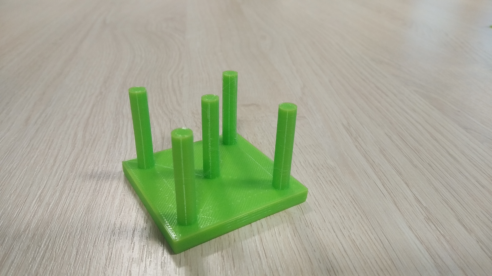
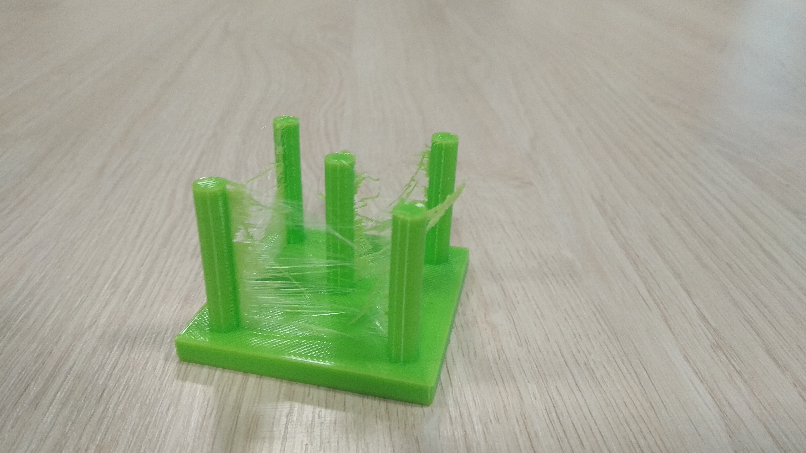
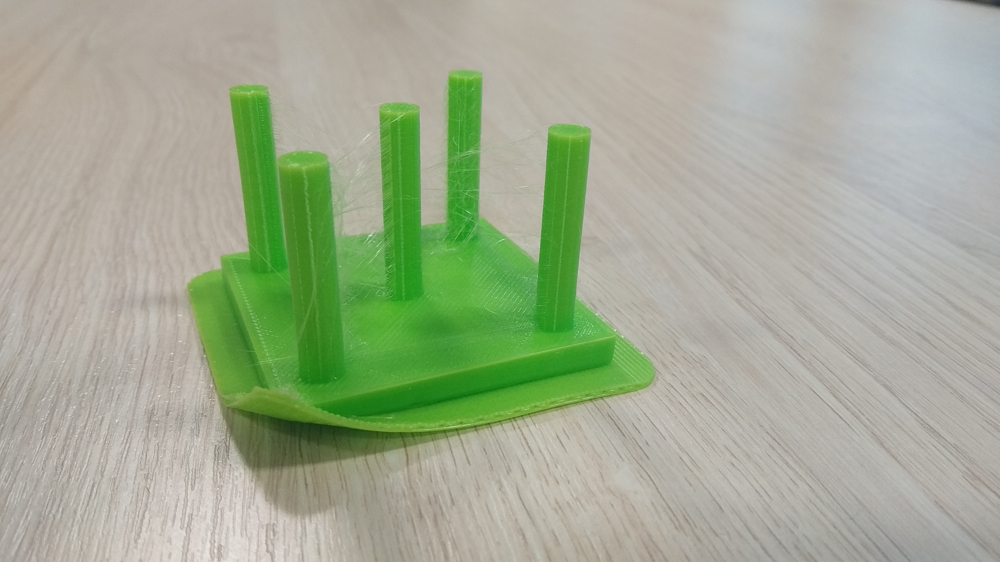
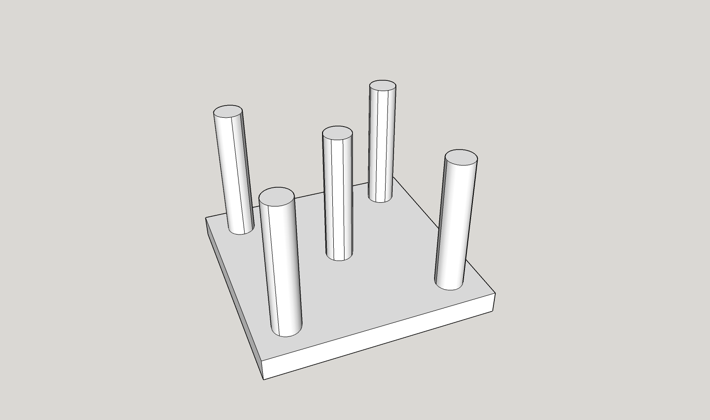

# 3D-Printing-Data 3D打印数据

This repository contains data gathered from 3D printing machine MonkeyFab Spire. Each directory contains data samples gathered from different prints, some of them being fault. 
该仓库包含从3D打印机MonkeyFab Spire收集的数据。每个目录包含来自不同打印作业的数据样本，其中一些样本存在故障。

## Data usage 数据使用

You are free to use this data under *Creative Commons Attribution 4.0 International* license. If you use our data, please [cite us as](https://link.springer.com/chapter/10.1007/978-3-030-77970-2_50#citeas):
您可以在*知识共享署名 4.0 国际*许可下自由使用这些数据。如果您使用我们的数据，请[按如下方式引用我们](https://link.springer.com/chapter/10.1007/978-3-030-77970-2_50#citeas)：

<cite>Szydlo T., Sendorek J., Windak M., Brzoza-Woch R. (2021) Dataset for Anomalies Detection in 3D Printing. In: Paszynski M., Kranzlmüller D., Krzhizhanovskaya V.V., Dongarra J.J., Sloot P.M. (eds) Computational Science – ICCS 2021. ICCS 2021. Lecture Notes in Computer Science, vol 12745. Springer, Cham. https://doi.org/10.1007/978-3-030-77970-2_50 </cite>

## Measurement devices characteristics 测量设备特性

The printer has been equipped with additional custom sensors developed as part of the FogDevices4 research project. Data from them was collected using a device assembled using modular hardware components. The printer has been equipped with two inertial measurement unit (IMU) sensors LSM9DS1 that can measure acceleration, angular rate and magnetic field in 3 axis but only linear acceleration was used in this case. First of the sensors, called accel0 is attached to the printing platform and accel1 is on the print head. Both of the sensors use the I2C digital interface and are connected to the FogDevices hardware platform.
打印机配备了作为FogDevices4研究项目一部分开发的额外定制传感器。这些传感器的数据通过使用模块化硬件组件组装的设备收集。打印机配备了两个惯性测量单元（IMU）传感器LSM9DS1，这些传感器可以测量3轴上的加速度、角速度和磁场，但在此情况下仅使用了线性加速度。第一个传感器称为accel0，附着在打印平台上，第二个传感器accel1安装在打印头上。两个传感器都使用I2C数字接口，并连接到FogDevices硬件平台。

## Data format 数据格式

Repository contains two types of data files:
仓库包含两种数据文件：

* Data that is provided by the web interface is in json file, in which each line contain different data sample object.
* Custom measurements are stored in files with csv format without header line and with a standard comma separator. 

### Data format of web interface 网络接口数据格式

The data is saved in _json_ files and each line contains separate sample. Example sample look like this:
数据保存在_json_文件中，每一行包含一个单独的样本。示例样本如下所示：

```json
{"status": "I", "coords": {"axesHomed": [1, 1, 1], "extr": [0.0], "xyz": [0.0, 0.0, 173.0]}, "currentTool": -1, "params": {"atxPower": 0, "fanPercent": [0.0, 0.0, 0.0, 0.0, 0.0, 0.0, 0.0, 0.0, 0.0], "speedFactor": 100.0, "extrFactors": [100.0], "babystep": 0.0}, "seq": 2, "sensors": {"probeValue": 0, "fanRPM": 0}, "temps": {"bed": {"current": 24.9, "active": 0.0, "state": 0, "heater": 0}, "current": [24.9, 25.1, 2000.0, 2000.0, 2000.0, 2000.0, 2000.0, 2000.0], "state": [0, 0, 0, 0, 0, 0, 0, 0], "heads": {"current": [25.1], "active": [210.0], "standby": [0.0], "state": [0]}, "tools": {"active": [[210.0]], "standby": [[0.0]]}, "extra": [{"name": "MCU", "temp": 39.0}]}, "time": 408.9, "timestamp": 1571996868631}
```

Because the data is nested json, the suggested way to read it into python is:
由于数据是嵌套的json，建议的Python读取方式如下：

```python
import pandas as pd
from pandas.io.json import json_normalize
df = pd.read_json('interface.json', lines=True)
df = json_normalize(df.to_dict('records'))
```

### Data format of custom measurements 自定义测量数据格式

The data of custom measurements is saved in _csv_ files with no headers and standard comma delimiter. There are following columns:
自定义测量数据保存在没有标题的_csv_文件中，使用标准逗号分隔符。文件包含以下列：

* **0** - contains data id assigned as the relative time set up on the device/包含作为设备上相对时间设置的数据ID
* **1-3** - 3-dimensional data from the first accelerometer (X, Y, Z axis respectively)/第一台加速度计的三维数据（分别为X、Y、Z轴）
* **4-6** - 3-dimensional data from the second accelerometer (X, Y, Z axis respectively)/第二台加速度计的三维数据（分别为X、Y、Z轴）
* **7** - tension measurements/张力测量
* **8** - timestamp/时间戳


In order to provide better understanding of the data, the following python script can be used to read data:
为了更好地理解数据，可以使用以下Python脚本来读取数据：

```python
import pandas as pd
df = pd.read_csv('accel.txt', names=['data_id', 'accel0X', 'accel0Y', 'accel0Z', 'accel1X', 'accel1Y',
                                'accel1Z', 'tension', 'timestamp'])
df['time'] = pd.to_datetime(df['timestamp'], unit='ms')
```

## Data files 数据文件

Reference properly made print:
参考正确打印的图像：



The files contain data from the following faulty situations:
这些文件包含以下故障情况的数据：

1. Finish of 3D printing plastic.
   3D打印塑料耗尽。
   

2. Bowden tube fallout.
   Bowden管脱落。

3. Wrong retraction setup.
   错误的回抽设置。
   

4. Arm failure.
   臂故障。

5. Unsticking of the printed model.
   打印模型的脱离。
   

6. Removing part of the print during the printing phase.
   打印过程中移除部分打印件。
   

## Repository organization 仓库组织

The directory structure is as follows:
目录结构如下：

 * _\four_towers_ - data related to printing towers model/相关于打印塔模型的数据
   
    
 
 * _\four_tower_no_base_ - data related to printing towers model, but without the base/ 相关于打印塔模型的数据，但没有基座
   
   
 
Each directory contains **.stl** file with the print source.
每个目录包含一个**.stl**文件作为打印源。
Data files are organised in the following subdirectories:
数据文件组织在以下子目录中：

1. _proper_ - reference print
   _proper_ - 参考打印
2. _plastic_lack_ 
   _plastic_lack_ - 塑料耗尽
3. _unstick_
   _unstick_ - 打印模型脱离
4. _bowden_
   _bowden_ - Bowden管脱落

And each of them contain two files: **.csv** one with data from custom-made measurement devices and **.json** file with data coming from the printer interface.
每个子目录包含两个文件：一个是**.csv**格式的自定义

测量数据文件，另一个是**.json**格式的打印机接口数据文件。

## Acknowledgments 鸣谢

Data presented in this repository was gathered, preprocessed and published as part of the project **LIDER/15/0144/L-7/15/NCBR/2016**. 
本仓库中展示的数据是作为项目**LIDER/15/0144/L-7/15/NCBR/2016**的一部分收集、预处理和发布的。
